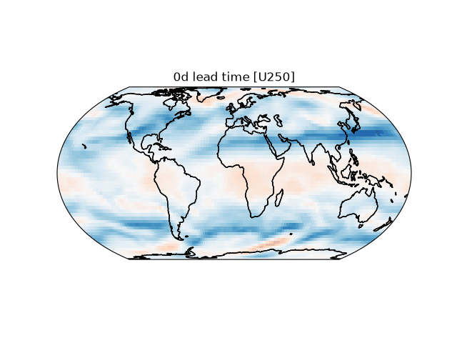

# Deep learning-based Weather Forecasting with WeT


30 day rollout using $\text{WeT}_{\text{AFNO}}$ trained on a small 20 year subset of ERA5.

---

### Special Dependencies

- SFNO requires the `torch_harmonics` package. For our experiments we built it for the latest PyTorch Version and CUDA 13.2

- To use the WeatherBench 2 tools, install `weatherbench2`:
  ```
  > git clone git@github.com:google-research/weatherbench2.git
  > cd weatherbench2
  > pip install .[tests]
  ```
